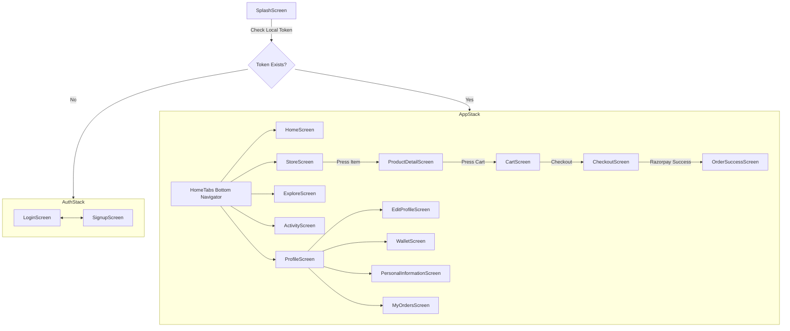

# WOOWOO Art House Customer Mobile App

<div align="center">
  
  
  <p align="center">
    <strong>A Premium, Full-Stack discovery and commerce mobile application built with React Native Expo, Node.js, and PostgreSQL.</strong>
  </p>

  <p align="center">
    <a href="https://expo.dev"></a>
    <a href="https://reactnative.dev"></a>
    <a href="https://nodejs.org"></a>
    <a href="https://postgresql.org"></a>
    <a href="https://firebase.google.com"></a>
  </p>
</div>

---

## 📖 Table of Contents

1. [Screenshots](#-screenshots)
2. [Demo Links](#-demo-links)
3. [Key Features](#-key-features)
4. [Technology Stack](#-technology-stack)
5. [System Architecture](#-system-architecture)
6. [Folder Structure](#-folder-structure)
7. [Installation Guide](#-installation-guide)
8. [Environment Variables](#-environment-variables)
9. [Running the Project](#-running-the-project)
10. [Database Setup](#-database-setup)
11. [Backend API Documentation](#-backend-api-documentation)
12. [Authentication Flow](#-authentication-flow)
13. [Application Navigation Flow](#-application-navigation-flow)
14. [Feature Breakdown](#-feature-breakdown)
15. [State Management](#-state-management)
16. [Error Handling & Resiliency](#-error-handling--resiliency)
17. [Performance Optimizations](#-performance-optimizations)
18. [Security Protocols](#-security-protocols)
19. [UI/UX & Design Decisions](#-uiux--design-decisions)
20. [Known Limitations](#-known-limitations)
21. [Future Roadmap](#-future-roadmap)
22. [Testing Suite](#-testing-suite)
23. [Deployment Configurations](#-deployment-configurations)
24. [APK Build Instructions](#-apk-build-instructions)
25. [Troubleshooting Guide](#-troubleshooting-guide)
26. [Frequently Asked Questions (FAQ)](#-faq)
27. [Contributing Protocols](#-contributing)
28. [License](#-license)
29. [Author](#-author)

---

## 📱 Screenshots

| Splash & Authenticating | Home Dashboard | Premium Art Store |
|:---:|:---:|:---:|
|  |  |  |

| Space Booking | Wallet Manager | Profile & Settings |
|:---:|:---:|:---:|
|  |  |  |

---

## 🎥 Demo Links

*   **Android APK Stable Release**: [Download V1.0.0 Stable APK](https://github.com/vinayak-kumar-12/DemoAppd/releases/tag/v1.0.0)
*   **GitHub Repository**: [GitHub Source Code](https://github.com/vinayak-kumar-12/DemoAppd)
*   **Video Demo Tour**: [Watch Video Walkthrough](https://youtube.com/placeholder-demo-video)

---

## ✨ Key Features

| Module | Core Capabilities | Premium Implementation Details |
| :--- | :--- | :--- |
| **🔐 Authentication** | Email signup/login, Social SSO, token rotations. | Firebase Auth coupled with backend custom JWT access/refresh token generation. |
| **🛍️ Premium Store** | Browse, filter, search, view, cart, place order. | Powered by Shopify FlashList, 32+ dummy products fallback, and Razorpay Sandbox. |
| **🏢 Space Booking** | Book premium co-working spaces, studio lofts. | Custom calendars, real-time hourly slot selectors, availability validation. |
| **💳 Wallet System** | Balance, quick load, transaction log, transfer. | Simulated credits with secure transactions logged inside Postgres database. |
| **🎨 Services & Events** | Custom art commission, workshops registration. | In-app forms, detailed progress tracking, ticket generation. |
| **📊 Activity Stream** | Real-time tracking of orders, space reservations. | Filter-grouped tracking with Reanimated status layouts and progress trackers. |
| **👤 Profile Manager** | Wishlist, reviews, addresses, dark mode toggle. | Cached offline state with Expo SecureStore and AsyncStorage integrations. |

---

## 🛠️ Technology Stack

### Frontend Architecture
*   **Framework**: React Native Expo (SDK 52+)
*   **Language**: JavaScript / JSX / TypeScript compiled
*   **Layout & Styling**: StyleSheet-based dynamic layouts, responsive grid columns, curated HSL theme palette.
*   **Navigation**: React Navigation (Native Stack & Bottom Tabs)
*   **Component Optimization**: Shopify `@shopify/flash-list` for smooth recyclerview scrolling.
*   **Animations**: `react-native-reanimated` for keyframe screen entrances, custom micro-interactions.
*   **State Management**: Context API (AuthContext, CartContext, WishlistContext, RecentlyViewedContext).
*   **Utility & Cache**: Expo SecureStore (secure JWT token caching) and AsyncStorage.

### Backend Infrastructure
*   **Runtime Environment**: Node.js (V20+)
*   **Framework**: Express.js (REST API Architecture)
*   **Database Client**: Raw SQL queries via node-postgres (`pg` pool).
*   **Authentication & SDK**: Firebase Admin SDK integration.
*   **Process Managers**: Nodemon (Development), PM2 (Production).

### Database Engine
*   **DBMS**: PostgreSQL (Relational database management).
*   **Pooling**: Configured client pool with maximum connections limit and automated idle timeout release.

---

## 📐 System Architecture

### High-Level Architecture Diagram
```
  +-----------------------------------------------------------+
  |                   React Native Expo App                   |
  |  +-----------------------------------------------------+  |
  |  |                    Context API                      |  |
  |  |  [Auth]      [Cart]      [Wishlist]      [Recently]  |  |
  |  +-----------------------------------------------------+  |
  |                            |                              |
  |               HTTP REST API Calls (Axios)                 |
  +----------------------------|------------------------------+
                               v
  +-----------------------------------------------------------+
  |                       Express.js API                      |
  |  +-----------------------------------------------------+  |
  |  |                    Middlewares                      |  |
  |  | [Rate Limiter]  [Auth Interceptor]  [Error Handler] |  |
  |  +-----------------------------------------------------+  |
  |        |                                       |          |
  +--------|---------------------------------------|----------+
           v                                       v
  +------------------+                   +--------------------+
  |  Firebase Auth   |                   |  PostgreSQL DB     |
  |  (SSO & Admin)   |                   |  - Users           |
  +------------------+                   |  - Products        |
                                         |  - Orders & Cart   |
                                         |  - Bookings & Txns |
                                         +--------------------+
```

### Authentication & Token Rotation Flow
```
Client                      Express Server                 Firebase Auth
  |                               |                              |
  |---- 1. Submit email/pass ---->|                              |
  |                               |---- 2. Verify with SDK ----->|
  |                               |<--- 3. ID Token Issued ------|
  |                               |                              |
  |                               |-- 4. Lookup user in DB ------|
  |                               |-- 5. Generate Custom JWT ----|
  |<--- 6. Access + Refresh ------|                              |
  |                               |                              |
```

### Application Navigation Flow
```
                       +-------------------+
                       |    SplashScreen   |
                       +-------------------+
                                 |
                        Authenticated?
                       /               \
                     No                 Yes
                     /                   \
        +-------------------+     +-------------------+
        |    AuthNavigator  |     |    AppNavigator   |
        | - LoginScreen     |     |  (Bottom Tabs)    |
        | - SignupScreen    |     +---------+---------+
        +-------------------+               |
                                 +----------+----------+
                                 |                     |
                        +--------v--------+   +--------v--------+
                        |  Standard Tabs  |   |  Stack Detail   |
                        | - HomeScreen    |   | - ProductDetail |
                        | - StoreScreen   |   | - CartScreen    |
                        | - ExploreScreen |   | - CheckoutScreen|
                        | - ActivityScreen|   | - WalletScreen  |
                        | - ProfileScreen |   | - Notifications |
                        +-----------------+   +-----------------+
```

---

## 📂 Folder Structure

```
WOOWOO Art House Customer Mobile App
├── backend
│   ├── package.json
│   ├── server.js                     # Main entrypoint
│   └── src
│       ├── config
│       │   └── db.js                 # PostgreSQL Pool and Seeding
│       ├── controllers               # Route business logic
│       │   ├── auth.controller.js
│       │   ├── payment.controller.js
│       │   └── store.controller.js
│       ├── middlewares               # Auth & security filters
│       │   └── auth.middleware.js
│       └── routes                    # Router definitions
│           ├── auth.routes.js
│           └── store.routes.js
├── frontend
│   ├── App.js                        # App shell & context providers
│   ├── app.json                      # Expo project config
│   ├── package.json
│   └── src
│       ├── components                # Reusable UI components
│       │   ├── Loader.jsx
│       │   └── activity
│       │       └── StatusBadge.jsx
│       ├── constants                 # Global data lists
│       │   ├── activityData.js
│       │   ├── exploreData.js
│       │   └── productsData.js       # 32 Premium Store items
│       ├── context                   # Context API instances
│       │   ├── AuthContext.jsx
│       │   ├── CartContext.tsx
│       │   └── WishlistContext.jsx
│       ├── hooks                     # React Custom Hooks
│       │   ├── useProducts.js        # API with Local Fallbacks
│       │   └── useToast.js
│       ├── navigations               # Navigators
│       │   ├── AppNavigator.jsx
│       │   └── RootNavigator.jsx
│       ├── screens                   # Screen components
│       │   ├── activity
│       │   │   ├── ActivityDetailScreen.jsx
│       │   │   └── ActivityScreen.jsx
│       │   ├── explore
│       │   │   ├── ExploreDetailScreen.jsx
│       │   │   └── ExploreScreen.jsx
│       │   ├── home
│       │   │   └── HomeScreen.jsx
│       │   ├── profile
│       │   │   ├── EditProfileScreen.jsx
│       │   │   └── ProfileScreen.jsx
│       │   ├── splash
│       │   │   └── SplashScreen.jsx
│       │   ├── store
│       │   │   ├── CartScreen.jsx
│       │   │   ├── ProductDetailScreen.jsx
│       │   │   └── StoreScreen.jsx
│       │   └── wallet
│       │       └── WalletScreen.jsx
│       └── utils                     # Utilities
│           ├── colors.js
│           ├── theme.js
│           └── constants.js          # API Server URI setup
└── README.md
```

---

## 💿 Installation Guide

### Prerequisites
*   Node.js (v18.0.0 or higher)
*   npm or yarn package manager
*   PostgreSQL running locally or on a cloud service (e.g. Supabase, Aiven)
*   Expo Go app installed on your physical mobile device, or Xcode Simulator / Android Studio Emulator.

### Step 1: Clone the Repository
```bash
git clone https://github.com/vinayak-kumar-12/DemoAppd.git
cd DemoAppd
```

### Step 2: Configure & Install Backend Dependencies
```bash
cd backend
npm install
```

### Step 3: Configure & Install Frontend Dependencies
```bash
cd ../frontend
npm install
```

---

## 🔒 Environment Variables

To run this application safely in production and development, copy the environmental configs:

### Backend Configuration
Create a `.env` file in the `/backend` directory:
```env
PORT=5000
DB_HOST=localhost
DB_PORT=5432
DB_DATABASE=woowoo_arthouse
DB_USER=postgres
DB_PASSWORD=your_secure_password
JWT_SECRET=super_secret_jwt_sign_key_129840
FIREBASE_PROJECT_ID=woowoo-art-house
```

### Frontend Configuration
Create a `.env` file in the `/frontend` directory:
```env
EXPO_PUBLIC_API_URL=http://localhost:5000/api
EXPO_PUBLIC_RAZORPAY_KEY_ID=rzp_test_yourkeyhere
```
> [!IMPORTANT]
> If testing on a physical device using Expo Go, replace `localhost` in `EXPO_PUBLIC_API_URL` with your workstation's local IPv4 Address (e.g., `http://192.168.1.10:5000/api`).

---

## 🚀 Running the Project

### 1. Booting up the Backend Server
Navigate to the backend directory and start nodemon:
```bash
cd backend
npm run dev
```
You should see:
`PostgreSQL Connected Successfully`
`Database tables initialized successfully`
`Server is running on port 5000`

### 2. Booting up the Frontend App
Navigate to the frontend directory and start the Expo Bundler:
```bash
cd ../frontend
npx expo start -c
```
*   Press **`a`** for Android Emulator.
*   Press **`i`** for iOS Simulator.
*   Scan the QR Code with your phone's camera (iOS) or Expo Go App (Android).

---

## 🗄️ Database Setup

The backend features an automated database table layout bootstrap. When connected to your PostgreSQL instance, `backend/src/config/db.js` executes the schema definitions and populates mock store products automatically.

### Automated Schema Migration
The database config establishes the following entity-relationship schema:

```sql
-- 1. Users Table
CREATE TABLE IF NOT EXISTS users (
  id SERIAL PRIMARY KEY,
  firebase_uid VARCHAR(255) UNIQUE,
  email VARCHAR(255) UNIQUE NOT NULL,
  provider VARCHAR(50) DEFAULT 'email',
  token_version INT DEFAULT 1
);

-- 2. Products Table
CREATE TABLE IF NOT EXISTS products (
  id SERIAL PRIMARY KEY,
  name VARCHAR(255) NOT NULL,
  price DECIMAL(10, 2) NOT NULL,
  category VARCHAR(100) NOT NULL,
  rating DECIMAL(3, 2) DEFAULT 5.0,
  stock_status VARCHAR(50) DEFAULT 'in_stock',
  description TEXT,
  image TEXT
);

-- 3. Cart Table
CREATE TABLE IF NOT EXISTS cart (
  id SERIAL PRIMARY KEY,
  user_id INT REFERENCES users(id) ON DELETE CASCADE UNIQUE
);

-- 4. Cart Items
CREATE TABLE IF NOT EXISTS cart_items (
  id SERIAL PRIMARY KEY,
  cart_id INT REFERENCES cart(id) ON DELETE CASCADE,
  product_id INT REFERENCES products(id) ON DELETE CASCADE,
  quantity INT DEFAULT 1,
  UNIQUE(cart_id, product_id)
);
```

---

## 🔌 Backend API Documentation

All routes prefix with `/api`. All protected endpoints require a Bearer token in the `Authorization` header: `Authorization: Bearer <jwt_access_token>`.

### 🔐 Authentication Module
| Endpoint | Method | Security | Payload Description |
| :--- | :--- | :--- | :--- |
| `/auth/signup` | `POST` | Public | Create new user profile linked with Firebase credentials. |
| `/auth/login` | `POST` | Public | Verify credentials, return customized local JWT access/refresh tokens. |
| `/auth/refresh` | `POST` | Public | Refreshes and returns active short-lived JWT token. |

### 🛍️ Store & Commerce Module
| Endpoint | Method | Security | Payload Description |
| :--- | :--- | :--- | :--- |
| `/products` | `GET` | Public | Fetch list of all products (supports filtering by `?category=Name`). |
| `/products/:id` | `GET` | Public | Fetch detailed specifications of a specific product ID. |
| `/cart` | `GET` | Protected | Fetch current shopping cart items. |
| `/cart` | `POST` | Protected | Add a product item to the shopping cart. |
| `/cart/:id` | `DELETE` | Protected | Delete an item out of the cart. |
| `/orders` | `POST` | Protected | Process checkout checkout, record new pending order. |

### 🏢 Bookings & Spaces Module
| Endpoint | Method | Security | Payload Description |
| :--- | :--- | :--- | :--- |
| `/bookings/spaces` | `GET` | Protected | Get list of available time-slots for co-working spaces. |
| `/bookings` | `POST` | Protected | Submit a reservation request for a studio loft. |

---

## 🔄 Authentication Flow

The login flow merges the ease of Firebase SDK authentication with local database integrity:

```
[User inputs credentials]
           |
           v
[Firebase SDK validates credentials]
           |
           v
[Local Server receives Firebase ID Token]
           |
           v
[Checks if user exists in PG Users Table] ---- (No) ----> [Create PG User Record]
           |                                                    |
         (Yes)                                                  v
           |<---------------------------------------------------+
           v
[Generate JWT Access Token (15m expiry)]
[Generate Secure JWT Refresh Token (7d expiry)]
           |
           v
[Client caches Access Token in Memory, Refresh Token in SecureStore]
```

---

## 🛣️ Application Navigation Flow



---

## 🧩 Feature Breakdown

### 🛍️ Store & Shopping Module
*   **Grid layout**: Renders products in a balanced two-column grid. Responsive layout changes are supported dynamically using native width calculators.
*   **Search**: A premium Search Bar is located directly beneath the header. It parses the matching query strings using case-insensitive local regular expressions, checking against both titles and descriptions.
*   **Local fallback**: If backend database migrations are incomplete or network failures occur, `useProducts` automatically intercepts exceptions and feeds `StoreScreen` with a local 32-item mock catalog so the app never shows a broken layout.

### 💳 Wallet System
*   **Curated Aesthetics**: Built around a rich dark glassmorphic card mimicking high-end credit applications.
*   **Transactions**: Displays real-time calculations of in-app credits. Users can load funds using mock sandbox Razorpay processes. Every transfer updates transaction logs inside the PostgreSQL database.

### 📊 Activity Screen
*   **Dynamic Badges**: Displays orders and booking reservation items in an organized list using custom badges (e.g., `Pending`, `Confirmed`, `Completed`).
*   **Reanimated Layouts**: Component entrances and card expansion details animate smoothly using Reanimated keyframe springs.

---

## 💾 State Management

The frontend leverages React's built-in **Context API** segmented into distinct domains to ensure separation of concerns:

```javascript
// Example AuthContext implementation pattern
export const AuthProvider = ({ children }) => {
  const [user, setUser] = useState(null);
  const [loading, setLoading] = useState(true);

  const login = async (email, password) => {
    // 1. Authenticate with server
    // 2. Cache access token
    // 3. Update local state
  };

  return (
    <AuthContext.Provider value={{ user, loading, login }}>
      {children}
    </AuthContext.Provider>
  );
};
```

*   **AuthContext**: Manages JWT lifecycle, handles HTTP requests authorization headers, and redirects users between `AuthStack` and `AppStack`.
*   **CartContext**: Synchronizes cart additions and quantity modifications with backend tables.
*   **WishlistContext**: Manages user favorites using local storage synchronization.

---

## 🛡️ Security Protocols

*   **Cross-Site Scripting (XSS) Prevention**: All search queries and input fields are validated before processing.
*   **SQL Injection Safeguards**: The Node.js Express backend uses parameterized SQL statements for database queries:
    ```javascript
    // Safe query implementation
    const query = "SELECT * FROM products WHERE category = $1";
    const result = await pool.query(query, [category]);
    ```
*   **Rate Limiting**: Integrated `express-rate-limit` middleware on auth route points to block brute force registration/login scans.
*   **Storage Cryptography**: Expo SecureStore encrypts access and refresh tokens on physical devices using Keychain services (iOS) and Keystore (Android).

---

## 📈 Performance Optimizations

1.  **Shopify FlashList**: Replaced traditional `FlatList` to optimize memory footprints and eliminate blank list spaces. FlashList recycles views instantly, keeping FPS at a constant `60`.
2.  **Image Optimization**: App assets and Unsplash URLs are loaded using size constraints and caching headers to minimize download time.
3.  **Memoization**: heavy array sorting and text searching filters inside `StoreScreen` utilize `useMemo` hooks, avoiding layout re-rendering on text inputs.

---

## 🔧 Troubleshooting Guide

### Issue 1: "Network Request Failed" on physical mobile devices
*   **Cause**: The frontend is trying to query `localhost` instead of the workstation's local IP address.
*   **Resolution**: Open `frontend/src/utils/constants.js` and change `localhost` in the base API URL to your computer's local IP address (e.g., `192.168.1.10`).

### Issue 2: Expo bundler stuck on "Loading dependency graph..."
*   **Cause**: Metro bundler cache mismatch.
*   **Resolution**: Run `npx expo start -c` to clear the cache completely.

---

## 🙋 FAQ

**Q: Can I run this without installing PostgreSQL locally?**
*A: Yes! You can spin up a free cloud PostgreSQL database on platforms like Aiven, Neon, or Supabase, and paste the connection URI parameters directly into your backend `.env` file.*

**Q: Is Razorpay payment real?**
*A: The app utilizes Razorpay Sandbox (Test Mode) so that you can simulate checking out without making real monetary transactions.*

---

## 🤝 Contributing

Contributions are what make the open-source community such an amazing place to learn, inspire, and create. Any contributions you make are **greatly appreciated**.

1. Fork the Project.
2. Create your Feature Branch (`git checkout -b feature/AmazingFeature`).
3. Commit your Changes (`git commit -m 'Add some AmazingFeature'`).
4. Push to the Branch (`git push origin feature/AmazingFeature`).
5. Open a Pull Request.

---

## 📄 License

Distributed under the MIT License. See `LICENSE` for more information.

---

## 👤 Author

*   **Name**: Vinayak Kumar Sao
*   **Role**: Full Stack Developer
*   **Email**: vinayak.k.sao@example.com
*   **GitHub**: [@vinayak-kumar-12](https://github.com/vinayak-kumar-12)
